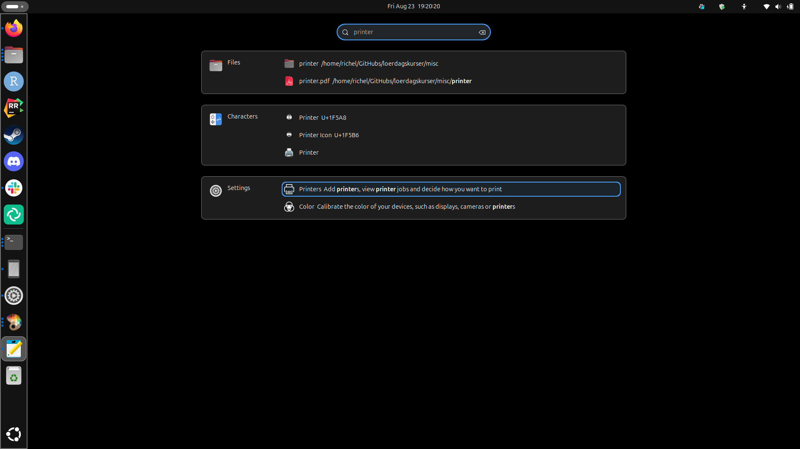
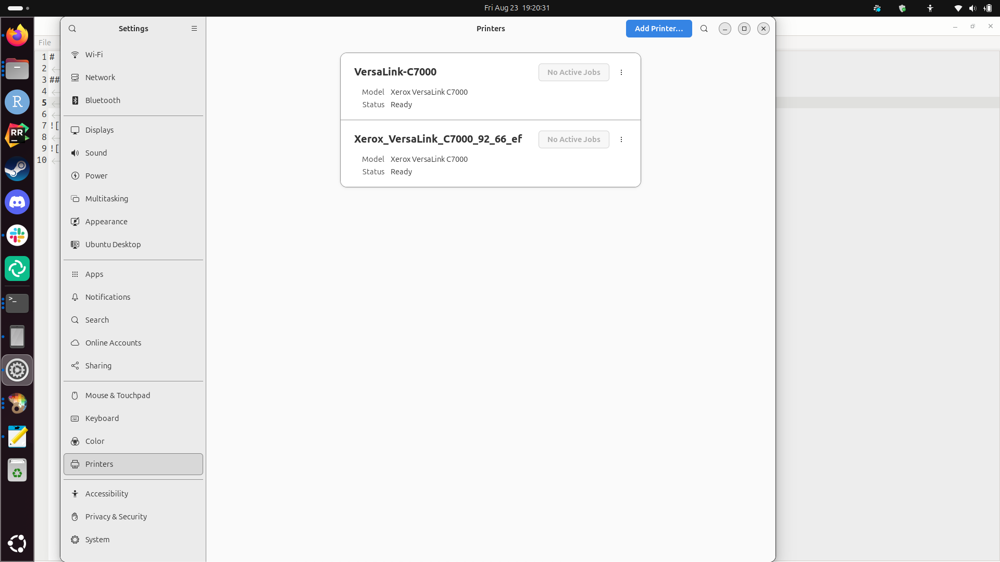
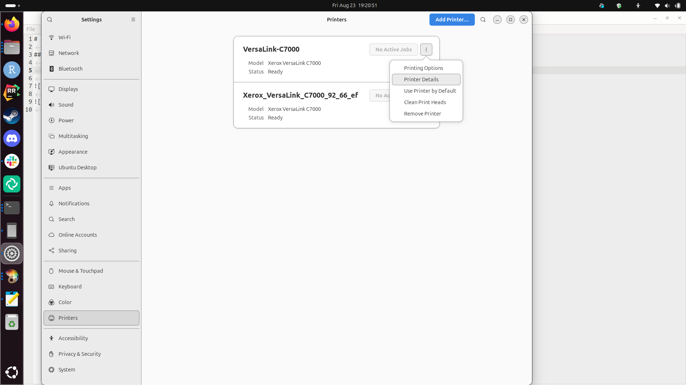
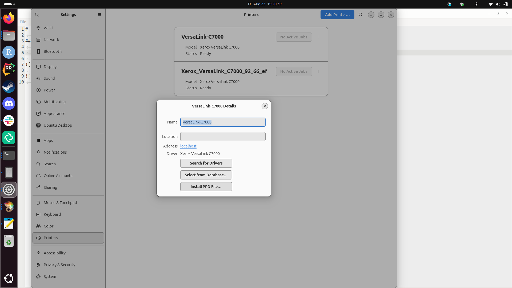
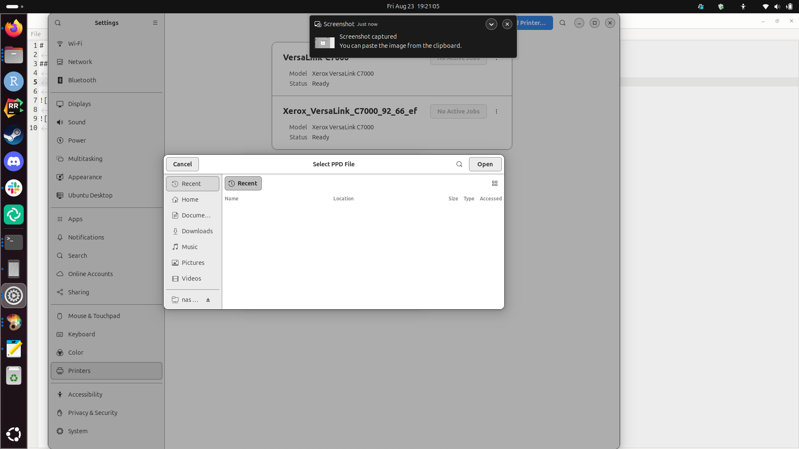
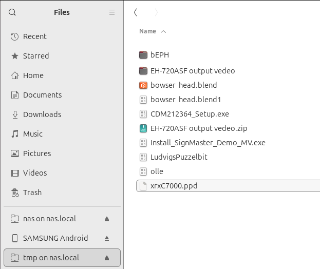
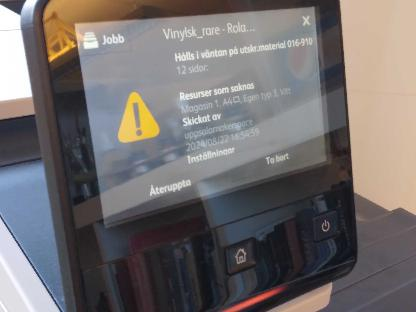
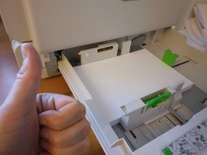

# Xeror Versalink C7000

## Print from your own laptop

Search for your printer settings, e.g. by pressing the Meta/Windows
key and search for 'Printer':

This will take you the 'Printer settings':

Click on 'Printer details':

Now you see your printer details:

Click 'Install PPD file'.

Now you see the 'Select PPD File' dialog:

You can find it in this repo: <xrxC7000.ppd>,
but also on this NAS:

In this folder:

Done!

## Troubleshooting

If the printer states that there is no paper and there is paper in tray 1 ...

What the printer states|What is in reality
-----------------------|-----------------------
|

then try the computer with the bigger screen (i.e. not the computer closest to the printer, but the one-but-closest instead).

This is because of the orientation of the A4 that is setup incorrectly by accident.

An alternative solution: go into the printer settings and specify that it should take paper from the cassette or manual, rather than "auto".

